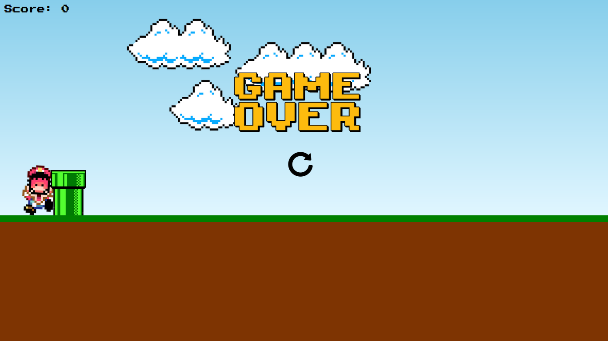

<h1 align="center"> Mario Game </h1>

  Projeto promovido pelo canal do youtube Manual do Dev.

  <a href="#-TECNOLOGIAS">Tecnologias</a>&nbsp;&nbsp;&nbsp;|&nbsp;&nbsp;&nbsp;
  <a href="#-PROJETO">Projeto</a>&nbsp;&nbsp;&nbsp;|&nbsp;&nbsp;&nbsp;
  <a href="#memo-licença">Licença</a>

  

 

  

## 🚀 TECNOLOGIAS
  Esse projeto foi desenvolvido com as seguintes tecnlogias: 
  
&nbsp;
&nbsp;
&nbsp;

## 💻 PROJETO
No Jogo do Mario, o objetivo é ajudar Mario, a evitar cano verde que aparecem repetidas vezes na tela. O jogador precisa pressinar na barra de espaço do teclado para fazer o Mario pular e evitar colidir com o obstáculo, cada pulo com sucesso é contabilizado 1 ponto(score). Caso o Mario colida, o jogo é encerrado. 

## :memo: LICENÇA

Esse projeto está sob a licença MIT.

